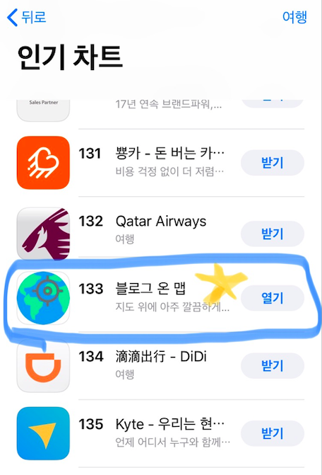

# Blog On Map앱 (iOS)

<br>


<br>

[🔗 블로그 온 맵 - 🍎 App Store 링크](https://apps.apple.com/kr/app/%EB%B8%94%EB%A1%9C%EA%B7%B8-%EC%98%A8-%EB%A7%B5/id1546232692)
<br>
<br>


<br>
<br>

- 한글 & 영문 지원
- iOS12.0 ~ 지원
  <br>
  <br>

## Outline

<br>

1. **앱이 해결하고자 한 문제**
   1. 니즈
   2. 나의 솔루션
2. **개발 기본 정보**
   1. 프레임워크 / 오픈 소스(라이센스)
3. **앱 성능 최적화 & 안정화를 위한 히스토리**
   1. 멀티스레딩을 이용한, 지도뷰 에임 태그( Address Aim Tag )기능 성능 최적화 & 안정화
   2. 유저 위치 추적 기능 안정화, 유한 상태 머신 벤치 마킹
   3. ??문제
4. **새로 배운 지식 정리**
   1. iOS 관련
   2. 스위프트 관련
   3. Design Pattern 관련
   4. 오픈 소스 관련
   5. 컴퓨터 사이언스 지식 응용
5. **비하인드 스토리**
   1. 심사 피드백
   2. 개선

<br>
<br>

## 1. 앱이 해결하고자 한 문제

<br>

### 1). 유저 니즈

코로나 이전에, 저는 여행 가는 것을 좋아했어요. 하지만, 정리와 기록을 잘하는 편이 아니라, 그날 일정이 끝나고, 여행이 끝나고 항상 다음과 같은 불편이 있었죠 :

---

- 이 사진이 어디서 찍은 거였지?
- 이 때가 어떤 상황이였지? 생각이 안 나네.
- 사진 여기가 어디였지?
- 이때 무슨 일이 있었더라?
- 그때 어떤 경로로 여행했더라?

**결론 : 에라 모르겠다 ~ 졸린다 자자!!😪 🛌**

---

<br>

### 2). 솔루션

<br>

1. **그때 그때, 나의 위치를 잡고, 사진을 찍어, 갤러리와 간단한 글을 바로 바로 지도 위에 올릴 수 있게.**
   <br>
   <br>


<br>

2. **타이밍을 놓쳤다면, 간편하게 주소를 검색해서, 그 위치에 갤러리와 기록을 남길 수 있게**
   <br>
   <br>


<br>

3. **유저가 주소를 모르는 곳도, 지도 위에서 쉽게 탐색하여 태그할 수 있게**
   <br>
   <br>


<br>

4. **지도에서 여행했던 곳들을 직관적으로 한 눈에 볼 수 있게**
   <br>
   <br>


<br>

<br>
<br>

## 2. 개발 기본 정보

<br>

### 1. 사용한 프레임워크 & 아키텍처 + 오픈 소스

<br>

- UIKit프레임워크, MVC아키텍처
  - 첫 프로젝트를 SwiftUI로 해봤으나, 업계에서는 아직 UIKit를 쓰고 있다는 정보를 들어서, 적응을 위해 UIKit로 진행했습니다.
  - <-> SwiftUI의 경우 :
    - MVVM 모델에 기초한다.
      - View란 상태(State)를 인풋으로하는 함수의 출력값
      - View의 내용을 변경하기 위한 유일한 방법은 View라는 함수의 입력값 =상태(State) 수정하는 것 뿐
        
      - != UIKit( MVC에 기초 ) 각종 이벤트들이 연속적으로 ViewController로 들어오고 ViewController는 개발자에게 ViewController가 관리하는 view에 직접 접근하여 UI를 수정
        - view란 오만 가지 이벤트를 포함 -> VC가 그것에 대하여 반응하여 자신이 통제하는 것들 업데이트
          - delegate 패턴
          - 컴플리션 핸들러
          - target-action
          - observer - notification center
    - 좋은 점 :
      - 앱의 복잡도가 증가에 비해 코드의 복잡도 적게 증가
      - 코드 유지보수를 한결 수월하게
    - 안 좋은 점 :
      - 13.0 ~ 부터 지원가능 -> 상당한 수의 유저 포기.
      - 비교적 신생 -> 복잡한 문제 해결 시, 넷에서 도움받을 자료가 비교적 적다.
- UIKit 채택 이유

  - 업계에서 쓰이기 때문에, 적응하기 위해.
  - 미래에 SwiftUI로 코드를 Migration할 때, 기존 코드에 대한 이해
  - 인터넷 자료의 방대함. UIKit 자료로 개념을 이해할 수 있다.

- 이외 기타 Native Framework - Core Data, Core Location, Map Kit
  <br>

- 사용한 오픈 소스
  - **YPImagePicker(MIT)**
    - 인스타그램 스타일 이미지 픽커 ⭐️
  - **KRWordWrapLabel(MIT)**
    - 한글의 단어 단위 줄바꿈이 가능한 UILabel Subclass

<br>

## (UX를 위한) 성능 개선 히스토리 📔

<br>

### 1. 멀티스레딩을 이용한, 주소 에임 태그( Address Aim Tag ) 성능 최적화

<br>


<br>
<br>

```
 유저가 주소를 검색한 위치 또는 현재 위치를 태그할 수는 있지만, 주소나 지명을 모르는 곳에 블로그를 쓰고 싶으면 어떻게 할까? 해외 여행에 가면, 꼭 이름을 아는 랜드마크가 아니라, 우연히 지나가게 된 곳?, 유명한 곳 옆에 거기?, 그 공원 옆에 가게? 등을 많이 지나가게 될 텐데 말이야.
```

이 이슈를 해결하기 위해. 지도뷰의 중심에 겨냥점을 설정하였습니다. 이 겨냥점을 통해 지도의 어떤 '주소를 모르는' 위치에도 태그가 가능해졌습니다.

하지만, 단순히 겨냥점을 주는 것에서 나아가, 유저에게 겨냥된 지점에 대한 주소 정보, 예를 들어, 거기가 ~시 ~동이다 등의 정보를 주석에 줄 수 있다면, 유저가 뜬금없는 장소에 태그할 일이 없겠다고 생각했습니다.

그러나, 지도앱을 사용할 때 유저는, 정말 빠르게 순식간에 다른 장소로 이동합니다. 하지만, 앱에서는, 그 순식 간에 다음의 작업을 진행해야합니다.

1.  맵뷰의 중심점을 조회
2.  그 중심으로 '애플 맵스' 서버에 주소 조회
3.  조회된 주소로 MKAnnotationView로 만들기
4.  보여주기

이 중, **<2>번 작업**은

```swift
self.geoCoder.reverseGeocodeLocation(  CLLocation(latitude: nowLat, longitude: nowLong) ){ placemarks, error in
               if let error = error {
                   return
               }
               if let placemarks = placemarks { //...
               }
```

인터넷 상황에 따라 비교적 긴 시간동안 지연될 수도 있고, 그 지점이 서버에서 주소로 치활할 수 없는 좌표일 주소를 반환하는 데 실패합니다. 만약, **이 절차를 동기 방식으로 메인 스레드에서** 실시한다면, 불확정한 긴 시간동안 앱이 얼어버릴 수 있고, 이러한 결함으로 인해 유저가 이탈하기 쉽습니다.

이에 대해 다음과 같은 최적화를 했습니다 :
<br>

```swift
//...(이상 생략)
let nowLat = self.mapView.centerCoordinate.latitude
let nowLong = self.mapView.centerCoordinate.longitude
        //
        //MARK: - find placemark for coordinate - background thread schedule
DispatchQueue.global().async {
    //
    let stdLat = nowLat
    let stdLong = nowLong
            //
self.geoCoder.reverseGeocodeLocation(  CLLocation(latitude: nowLat, longitude: nowLong) ){ placemarks, error in
    //MARK - Network Issue Notice
    if let _ = error {
        if !self.hasNoticedNetworkAimTagIssue{
            DispatchQueue.main.async {
                let alert = UIAlertController(title: "네트워크 오류".localized(), message: "네트워크가 연결되어있지 않습니다. 이 경우 태그가 정상적으로 작동하지 않습니다.".localized(), preferredStyle: .alert)
                let action = UIAlertAction(title: "확인".localized(), style: .default){_ in
                    alert.removeFromParent()
                }
                alert.addAction(action)
                self.present(alert, animated: true, completion: nil)
            }
            self.hasNoticedNetworkAimTagIssue = true // 1회만 공지
        }
        return
    }
    //MARK: - Network Works
    if let placemarks = placemarks {
        let responsePlacemark = placemarks.last!
        DispatchQueue.main.async {
            if ( self.updatedMapViewCenter!.longitude == stdLong && self.updatedMapViewCenter!.latitude == stdLat) {
                //
                self.currentCenterPlacemark = responsePlacemark
                //
                let currentCenterLocation = CurrentCenterLocation()
                currentCenterLocation.coordinate = responsePlacemark.location!.coordinate
                currentCenterLocation.title = "여기에 블로그 작성 📷".localized()
                var addressString = string(from: responsePlacemark )
                if addressString.isEmpty { addressString = "미등록 주소".localized()}
                currentCenterLocation.subtitle = addressString
                //
                self.mapView.addAnnotation( currentCenterLocation )
                self.tillNowMapAddedCenterAnnotations.append( currentCenterLocation )
                //
            }
        }
    }
}
```

1. geocoding 시도를 GCD를 통해, 백그라운드 큐에서 비동기로 실시한다.
2. 1번에 대해서 네 가지 경우의 수가 가능합니다 :
   <br><br>

- 네트워크도 정상이고, 좌표에 해당하는 주소 정보도 수령한 경우<br>
- 네트워크는 정상이지만, 좌표에 해당하는 주소 정보가 없는 경우 <br>
- 네트워크가 연결되어 있지 않은 경우 <br>
- 네트워크가 너무 느린 경우 <br>
  <br>

- 네트워크도 정상이고, 좌표에 해당하는 주소 정보도 수령된 경우 :<br>
  &nbsp;&nbsp;이 경우에는, 다음의 작업을 다시 메인큐에 클로저로 비동기 스케줄링 합니다 :<br> { 검색이 이루어졌던 기준 좌표가, 여전히 유저의 현재 맵뷰 좌표의 중심과 일치한다면, 그 지점에 대하여 반환받은 CLPlacemark와 함께, 에임 주석을 설치합니다. }
  <br>
- 네트워크는 정상이지만, 좌표에 해당하는 주소 정보가 없는 경우 :<br>
  &nbsp;&nbsp; 이 경우에는 다음의 작업을 메인큐에 다시 비동기로 스케쥴링 합니다 :<br> { 검색이 이루어졌던 기준 좌표가, 여전히 유저의 현재 맵뷰 좌표의 중심과 일치한다면, 그 지점에 대해 "미등록 주소"로 subtitle을 설정하여 에임 주석을 설치합니다.}
- 네트워크가 연결되어 있지 않은 경우 :<br>
  &nbsp;&nbsp; 이 경우에는 다음의 작업을 메인큐에 다시 비동기로 스케쥴링 합니다 :<br> { ⭐️ 유저에게 어떤 이유로 에임 태그가 작동하지 않는지 알립니다. 1회에 한 해서, Alert 창을 띄웁니다. "현재 네트워크 연결이 되지 않아, 에임 태그 기능을 사용할 수 없습니다. 에임 태그를 사용하시려면, 인터넷을 다시 연결해주세요." }
- 네트워크가 너무 느린 경우 :<br>
  &nbsp;&nbsp; 실제로, Network Link Conditioner를 통해서, 실험해본 결과<br>


<br>

&nbsp;&nbsp;지연이 발생하는 네트워크 상황에서는, 에임 태그가 계속해서 요청된 시간에 비해, 긴 간격의 엇박으로 설치되는 것을 목격했습니다.
<br>


<br>

이 경우, 유저는 어떤 상황인지 모르고, 중간 이탈 할 수도 있습니다. 여러 번 사용해본 결과, 유저가 앱이 고장났나 하고 의심하게 되어 불편해하기 시작하는 시점이 3초 이상부터였습니다.**심지어 앱이 데이터 연결 조건이 좋지 않은 경우가 많은 해외 여행 중을 타겟팅하기 때문에 이러한 핸들링이 더 중요했습니다.**

<br>

3초 이상 에임 태그가 설치가 안 될 경우, 유저가 정확하게 상황을 인지하기 위해, 지연 이유에 대하여 1회에 한 해 alert창을 띄울 필요가 있었습니다.
<br>


<br>

이와 같이 대응하기 위해, 다음과 같은 코드를 뷰가 나타난 후 실행되는 **viewDidAppear** 함수에 hook하였습니다.

<br>

```swift
    override func viewDidAppear(_ animated: Bool) {
        //MARK:- First Update Starts
            // 3초 후에 비동기 스케줄링
        print("View Did Appear and scheduled")
        DispatchQueue.main.asyncAfter(deadline: .now() + 3) {
            if !self.initialAimTagSet && !self.hasNoticedNetworkAimTagIssue && !self.noticedSlowNetwork {
                print("Satisfied Condition")
                let alertController = makeAlert(withTitle: "좋지 않은 네트워크 상황".localized() , withContents: "네트워크가 느릴 경우 에임 태그가 지연되어 설치될 수 있습니다 🎯".localized())
                self.present(alertController, animated: true, completion: nil)
                self.noticedSlowNetwork = true
            }
        }
        //
    }
```

1. GCD님, View가 스크린에 등장할 때를 기점으로 다음의 { } 클로저 블록을, 현 시점으로 부터, 3초 후에 **메인 쓰레드에 비동기 방식**으로 스케쥴 해주세요.
2. 클로저 블록 : { 만약 뷰가 스크린에 등장한 이래로 3초가 지난 시점까지, 1). 첫 에임 태그가 설치되어있지 않고 2). 네트워크가 아예 연결되어 있지 않은 경우가 아니고( 이때는 네트워크가 연결되어 있지 않다는 알러트 창을 띄울 로직이 다른 곳에 이미 있으므로) 3). 앱 실행 후 Slow Network가 에임 태그를 지연시킬 수 있다는 알러트 창을 이전에 띄운 적이 없을 경우에 한해서 "네트워크가 느릴 경우 에임 태그가 지연되어 설치될 수 있습니다 🎯" 라는 알러트 창을 띄울 것 }
   <br>
   <br>

## Q : 왜 DispatchQueue.main.asyncAfter(deadline : .now() + 3){ block } 인거지 ?

<br>

처음엔 그저 우와, 3초 후에 알러트 창을 띄워주네 하고 마냥 즐거웠습니다. <br>

하지만, 다음의 의문이 들기 시작했습니다. <br>

**1). 꼭 메인 큐에 해야할까? 글로벌 큐에서 하는 건 어떤데?**<br>
**2). 왜 .async 비동기로 스케줄링 하지? 이거 UI를 블록하는 무거운 작업도 아닌 데? 그냥 main.sync하면 안 되나?**

<br>

### **1), 2)번을 대답하기 위한 리서치 :** [참고 사이트](https://zeddios.tistory.com/519)

<br>

1. UIApplication 인스턴스가 메인 쓰레드에 attached 되어 있다.
2. UIEvent(터치, 핀치, 스와이프 등등)는 다음의 Responder Chain( 반응 체인을 )을 따라 UIResponder까지 전달 : <br><br>
   &nbsp;&nbsp;1. **UIApplication** : 앱의 런루프, 메인 이벤트 루프 설정 + 앱 실행, 앱 메인 이벤트 처리 담당, 유저 상호작용 이벤트를 체인에 따라 전달~ 전달~ 하는 출발점<br>
   &nbsp;&nbsp;2. UIWindow.<br>
   &nbsp;&nbsp;3. UIController.<br>
   &nbsp;&nbsp;4. UIView.<br>
   &nbsp;&nbsp;5. UIView(subview)<br>
   &nbsp;&nbsp;**6. UIResponder : UIEvent에 따라 인터페이스 변경**<br><br>

3. UI요소에 대한 접근과 조작은 UIApp이 붙어있는 메인에서 해야한다. UIApp.님이 메인 스레드에서 상주하시기 때문에.

4. `Dispatch.main.sync{ }`의 의미<br>
   &nbsp;&nbsp;
   sync : 현재 작업 처리중이던, 1). 큐를 블록하고 2). { } 클로저 안에 정의된 작업이, 작업을 배치한 큐에서 마무리된 후에 다시 3). 큐 블록을 풀고 업무를 재개 하겠다.&nbsp;
   즉, 메인 스레드에서 `Dispatch.main.sync{ }`를 실행하는 것은 : 1). 우선 메인 스레드에서 진행할 작업을 공급하는 메인 큐를 블록하겠다 2). 그리고 메인 큐에 { } 클로저 작업을 스케줄링 하겠다 ~하는 매우 이상한 상황이 됩니다. 큐가 블록되어, 메인 쓰레드는 업무 중단을 했는데, { }를 또 메인 큐에 스케줄링 한 것입니다.
   <br>
   <br>

## 결론 : 그러므로, main.async 방식으로 다음의 작업을 진행하는 것은 합리적인 게 됩니다.

<br>

```swift
DispatchQueue.main.asyncAfter(deadline: .now() + 3) {
            if !self.initialAimTagSet && !self.hasNoticedNetworkAimTagIssue && !self.noticedSlowNetwork {
                print("Satisfied Condition")
                let alertController = makeAlert(withTitle: "좋지 않은 네트워크 상황".localized() , withContents: "네트워크가 느릴 경우 에임 태그가 지연되어 설치될 수 있습니다 🎯".localized())
                self.present(alertController, animated: true, completion: nil)
                self.noticedSlowNetwork = true
            }
```

<br>

- 3초후에, UI처리를 할 수 있는 메인 쓰레드에 작업을 스케줄링 해주는 메인 큐에, { 여전히 에임 주석이 설치되어 있지 않을 경우 -> 네트워크가 느려서 에임 주석 설치에 딜레이가 발생할 수 있다는 작업을 스케줄링 }
- **단, 스케줄링만 해놓고 메인 스레드 하던 일 계속할 것 !!**
  <br>

### ~를 통해, 뷰가 등장하고 약 3초 후에 alert창을 성공적으로 띄울 수 있었습니다.

<br>
<br>

## 문제2. Location Manager를 활용한, 유저 좌표(및 주소) 추적 기능 안정화( = 유한 상태 머신 )

<br>


<br>

Core Location 프레임워크의 Core Location Manager 객체를 통해, 현재 유저의 좌표를 원하는 정확도( 추정 오차 범위 : x 미터 이내 )로 가져오는 작업에는 총 6가지의 상태(State)가 있다는 것을 알게되었습니다. 각 케이스별로 업데이트 해야할 버튼, 경우에 따라 발생시킬 alert창 들이 너무 다양했고. 코드를 짜기가 매우 복잡했습니다. 이때 생각난 게, **논리 설계** 시간에 배웠던 **유한 상태 기계** 였습니다. <br>
**유한 상태 기계** 는 컴퓨터의 작은 부품들과 기계의 기초가 되는 기계에 대한 개념인데, 어떠한 기계가 가진 각종 상태들이 오직 몇 비트의 입력 이 바뀜으로 인해 일정한 흐름으로 변하는 것이었습니다. 겉으로 보기에는 매우 복잡한 변화가 일어나는 것 처럼 보이지만, 그 기계 속에서는 오직 3-4 비트의 입력만이 변하고 있었던 것입니다. <br>
뭔가 이 많은 라벨, 앨러트 창,버튼의 가시성 등 겉으로 활발히 변하고 있는 것들도, 결국 기저에서는 6가지 가능한 상태가 변하는 것에 불과하니, `state = .beforePress` 상태라는 변수에, `.(상태_종류_중_하나의_값)`를 지정(assign)해주는 것만으로, 간단하게 타이밍에 맞게 UI 요소들을 업데이트 해주면 빠트리는 것 없이 위 스크린의 흐름을 만들 수 있을 것이라고 생각했습니다. 위와 같은 작동을 위해, state 변수에 대해서, property observer인 `didSet`을 사용하였습니다.

### 이 방식을 통해, 간편하게 커버하지 못하는 경우의 수 없이, 라벨, 버튼, 알러트 창을 일괄적으로 컨트롤 할 수 있었습니다.

<br>

```swift
enum CurrentLocationState {
    case beforePress, updatingLoc, completeLoc, unknownTill6, unknownToFail, locSerDeniedDetected
```

1. **beforePress**(any request button) :<br>
   &nbsp;&nbsp;앱이 시작되고 유저가 어떠한 버튼도 누르지 않은 상태
2. **updatingLoc**(ation) :<br>
   &nbsp;&nbsp;**(6초(타임 아웃 기준)가 경과하기 전)** 위치에 대한 업데이트를 로케이션 매니저로부터 1회 이상 받았으나, 코드에서 지정한 정확도에는 도달하지 못한 상태
3. **completeLoc**(ation) :<br>
   &nbsp;&nbsp;코드에 지정된 정확도(예시:오차범위 10미터 이내) 이상의 장소 정보 업데이트를 받은 상황
4. **unknowTill6**(seconds) :<br>
   &nbsp;&nbsp;위치 추적 요청을 받은 뒤 **6초가 이미 지났고,** 여전히 위치에 대한 업데이트를 한 번도 못받은 상태
5. **unknownToFail** :<br>
   &nbsp;&nbsp;인터넷 연결이 없어서, 또는 타임 아웃 기준 **6초**까지 로케이션 매니저로부터 위치 정보 업데이트를 한 번도 못 받은 상황.
6. **loc(ation)Ser(vice)DeniedDetected** :<br>
   &nbsp;&nbsp;유저가 위치 서비스를 비활성화한 상태
   <br>
   <br>

이 후, Enumeration Data Type값이, 각 상태 값에 맞는 라벨들을 반환할 수 있도록 computed property를 짰습니다.

```swift
// 업데이트할 라벨, 버튼 종류
// msgLabelText
// addressLabelText
// blogLabelisHidden
// getLocationButtonTitle

enum CurrentLocationState {
    //
    case beforePress, updatingLoc, completeLoc, unknownTill6, unknownToFail, locSerDeniedDetected
    var msgLabelText : String {
        switch self {
        case .beforePress:
            return "( 나의 위치를 찾아보세요 )".localized()
        case .updatingLoc:
            return "위치를 더 정확하게 감지하는 중...".localized()
        case .completeLoc:
            return "위치 검색 완료\n정확한 위치에는 셀룰러 데이터📶\n사용이 도움이 됩니다.".localized()
        case .unknownTill6:
            return "위치 검색 중...".localized()
        case .unknownToFail:
            return "( 위치 검색 실패 )".localized()
        case .locSerDeniedDetected:
            return "(위치 서비스가 허용되어 있지 않습니다.)".localized()
        }
    }
    //
    var addressLabelText : String {
        switch self {
            case .beforePress:
                return "아직 검색된 주소가 없습니다.".localized()
            case .updatingLoc:
                return "아직 위치가 확정되지 않았습니다".localized()
            case .completeLoc:
                return "아직 위치가 확정되지 않았습니다".localized() //🍎 지오 코딩된 실제 주소를 넣기
            case .unknownTill6:
                return "아직 위치가 확정되지 않았습니다".localized()
            case .unknownToFail:
                return "아직 검색된 주소가 없습니다.".localized()
            case .locSerDeniedDetected:
                return "아직 검색된 주소가 없습니다.".localized()
        }
    }
    //
    var blogButtonIsHidden : Bool {
        return true
    }
    //
    var getLocationButtonTitle : String {
            switch self {
                case .beforePress:
                    return "내 위치 가져오기".localized()
                case .updatingLoc:
                    return "위치 업데이트 중지".localized()
                case .completeLoc:
                    return "내 위치 다시 가져오기".localized()
                case .unknownTill6:
                    return "" //🍎  isHidden  = true
                case .unknownToFail:
                    return "위치 가져오기 다시 시도".localized()
                case .locSerDeniedDetected:
                    return "위치 가져오기 다시 시도".localized()
            }
    }
}
```

이렇게 Enumeration Type을 정의하고, currentLocationState 변수의 didSet(속성 옵저버)에는 각 Enumeration 값이 가지는 computed property값이 지정되게 논리를 짰습니다.

```swift
    var currentLocationState : CurrentLocationState? {
        didSet {
            // Defensive
            if  !( [ CurrentLocationState.unknownTill6 , CurrentLocationState.updatingLoc ].contains(currentLocationState) ){
                self.stopIndicator()
            }
            //
            configureLabel()
            //
            if currentLocationState == CurrentLocationState.completeLoc && performingGeocoding == false{
                let onceConfirmedLocation = location!
                performingGeocoding = true
                geoCoder.reverseGeocodeLocation( onceConfirmedLocation ){ placemarks, error in
                    if let placemarks = placemarks {
                        let responsePlacemark = placemarks.last!
                        if self.currentLocationState == CurrentLocationState.completeLoc {
                            self.currentPlacemark = responsePlacemark
                            self.addressLabel.text = string(from: self.currentPlacemark!)
                            self.WriteBlogButton.isHidden = false
                            self.playSoundEffect()
                        }
                    }
                    else {
                        self.makeAlert( withTitle: "에러".localized(), withContents: "인터넷이 연결되어 있지 않거나, 조회가 되지 않는 주소입니다.".localized() )
                        self.currentLocationState = CurrentLocationState.beforePress
                    }
                    self.performingGeocoding = false
                }
            }
        }
    }
```

&nbsp;&nbsp;이 방식을 통해, Location Manager를 통해 위치 정보를 받아와 표시하는 과정에서 생길 수 있는, 경우의 수에 맞게, state = .상태를 지정해주는 것만으로도, UI요소를 일괄적으로 핸들링할 수 있었습니다.
상황에 맞게 메시지 라벨, 앨러트 창을 빠짐없이 통제할 수 있으면, 유저가 `앱이 현재 어떤 상황인지 정확히 인지`하고, 위치 업데이트가 진행 중이니 기다리거나, 인터넷 연결을 한 번더 확인하거나 정확한 피드백을 받을 수 있습니다.
