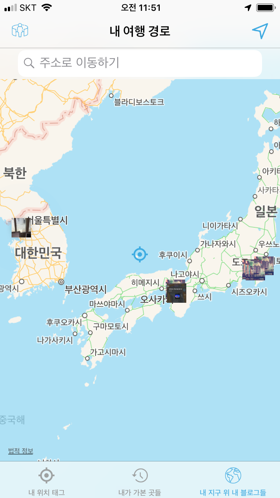

# Blog On Map앱 (iOS)

<br>


<br>

[🔗 블로그 온 맵 - 🍎 App Store 링크](https://apps.apple.com/kr/app/%EB%B8%94%EB%A1%9C%EA%B7%B8-%EC%98%A8-%EB%A7%B5/id1546232692)
<br>
<br>

- 한글 & 영문 지원
- iOS12.0 ~ 지원
  <br>
  <br>

## Outline

<br>

1. **앱이 해결하고자 한 문제**
   1. 니즈
   2. 나의 솔루션
2. **개발 기본 정보**
   1. 프레임워크 / 오픈 소스(라이센스)
3. **앱 개선을 위한 히스토리**
   1. ~문제
   2. ~문제
   3. ~문제
   4. ~문제
4. **새로 배운 지식 정리**
   1. iOS 관련
   2. 스위프트 관련
   3. Design Pattern 관련
   4. 오픈 소스 관련
   5. 컴퓨터 사이언스 지식 응용
5. **비하인드 스토리**
   1. 심사 피드백
   2. 개선

<br>
<br>

## 1. 앱이 해결하고자 한 문제

<br>

### 1). 유저 니즈

```
코로나 이전에, 저는 여행 가는 것을 좋아했어요. 하지만, 정리와 기록을 잘하는 편이 아니라, 그날 일정이 끝나고, 여행이 끝나고 항상 다음과 같은 불편이 있었죠 :

- 이 사진이 어디서 찍은 거였지?
- 이 때가 어떤 상황이였지? 생각이 안 나네.
- 사진 여기가 어디였지?
- 이때 무슨 일이 있었더라?
- 그때 어떤 경로로 여행했더라?

결론 : 에라 모르겠다 ~ 졸린다 자자!!😪 🛌
```

### 2). 솔루션

<br>

1. **그때 그때, 나의 위치를 잡고, 사진을 찍어, 갤러리와 간단한 글을 바로 바로 지도 위에 올릴 수 있게.**
   <br>
   <br>


<br>

2. **타이밍을 놓쳤다면, 간편하게 주소를 검색해서, 그 위치에 갤러리와 기록을 남길 수 있게**
   <br>
   <br>


<br>

3. **유저가 주소를 모르는 곳도, 지도 위에서 쉽게 탐색하여 태그할 수 있게**
   <br>
   <br>


<br>

4. **지도에서 여행했던 곳들을 직관적으로 한 눈에 볼 수 있게**
   <br>
   <br>


<br>

<br>
<br>

## 2. 개발 기본 정보

<br>

### 1. 사용한 프레임워크 & 아키텍처 + 오픈 소스

<br>

- UIKit프레임워크, MVC아키텍처
  - 첫 프로젝트를 SwiftUI로 해봤으나, 업계에서는 아직 UIKit를 쓰고 있다는 정보를 들어서, 적응을 위해 UIKit로 진행했습니다.
  - <-> SwiftUI의 경우 :
    - MVVM 모델에 기초한다.
      - View란 상태(State)를 인풋으로하는 함수의 출력값
      - View의 내용을 변경하기 위한 유일한 방법은 View라는 함수의 입력값 =상태(State) 수정하는 것 뿐
        
      - != UIKit( MVC에 기초 ) 각종 이벤트들이 연속적으로 ViewController로 들어오고 ViewController는 개발자에게 ViewController가 관리하는 view에 직접 접근하여 UI를 수정
        - view란 오만 가지 이벤트를 포함 -> VC가 그것에 대하여 반응하여 자신이 통제하는 것들 업데이트
          - delegate 패턴
          - 컴플리션 핸들러
          - target-action
          - observer - notification center
    - 좋은 점 :
      - 앱의 복잡도가 증가에 비해 코드의 복잡도 적게 증가
      - 코드 유지보수를 한결 수월하게
    - 안 좋은 점 :
      - 13.0 ~ 부터 지원가능 -> 상당한 수의 유저 포기.
      - 비교적 신생 -> 복잡한 문제 해결 시, 넷에서 도움받을 자료가 비교적 적다.
- UIKit 채택 이유

  - 업계에서 쓰이기 때문에, 적응하기 위해.
  - 미래에 SwiftUI로 코드를 Migration할 때, 기존 코드에 대한 이해
  - 인터넷 자료의 방대함. UIKit 자료로 개념을 이해할 수 있다.

- 이외 기타 Native Framework - Core Data, Core Location, Map Kit
  <br>

- 사용한 오픈 소스
  - **YPImagePicker(MIT)**
    - 인스타그램 스타일 이미지 픽커 ⭐️
  - **KRWordWrapLabel(MIT)**
    - 한글의 단어 단위 줄바꿈이 가능한 UILabel Subclass

<br>

## (UX를 위한) 성능 개선 히스토리 📔

<br>

### 1. 멀티스레딩을 이용한, 주소 에임 태그( Address Aim Tag ) 성능 최적화

<br>


<br>
<br>

```
 유저가 주소를 검색한 위치 또는 현재 위치를 태그할 수는 있지만, 주소나 지명을 모르는 곳에 블로그를 쓰고 싶으면 어떻게 할까? 해외 여행에 가면, 꼭 이름을 아는 랜드마크가 아니라, 우연히 지나가게 된 곳?, 유명한 곳 옆에 거기?, 그 공원 옆에 가게? 등을 많이 지나가게 될 텐데 말이야.
```

이 이슈를 해결하기 위해. 지도뷰의 중심에 겨냥점을 설정하였습니다. 이 겨냥점을 통해 지도의 어떤 '주소를 모르는' 위치에도 태그가 가능해졌습니다.

하지만, 단순히 겨냥점을 주는 것에서 나아가, 유저에게 겨냥된 지점에 대한 주소 정보, 예를 들어, 거기가 ~시 ~동이다 등의 정보를 주석에 줄 수 있다면, 유저가 뜬금없는 장소에 태그할 일이 없겠다고 생각했습니다.

그러나, 지도앱을 사용할 때 유저는, 정말 빠르게 순식간에 다른 장소로 이동합니다. 하지만, 앱에서는, 그 순식 간에 다음의 작업을 진행해야합니다.

1.  맵뷰의 중심점을 조회
2.  그 중심으로 '애플 맵스' 서버에 주소 조회
3.  조회된 주소로 MKAnnotationView로 만들기
4.  보여주기

이 중, **<2>번 작업**은

```swift
self.geoCoder.reverseGeocodeLocation(  CLLocation(latitude: nowLat, longitude: nowLong) ){ placemarks, error in
               if let error = error {
                   return
               }
               if let placemarks = placemarks { //...
               }
```

인터넷 상황에 따라 비교적 긴 시간동안 지연될 수도 있고, 그 지점이 서버에서 주소로 치활할 수 없는 좌표일 주소를 반환하는 데 실패합니다. 만약, **이 절차를 동기 방식으로 메인 스레드에서** 실시한다면, 불확정한 긴 시간동안 앱이 얼어버릴 수 있고, 이러한 결함으로 인해 유저가 이탈하기 쉽습니다.

이에 대해 다음과 같은 최적화를 했습니다 :
<br>

```swift
DispatchQueue.global().async {
    //
    let stdLat = nowLat
    let stdLong = nowLong
            //
self.geoCoder.reverseGeocodeLocation(  CLLocation(latitude: nowLat, longitude: nowLong) ){ placemarks, error in
    //MARK - Network Issue Notice
    if let _ = error {
        if !self.hasNoticedNetworkAimTagIssue{
            DispatchQueue.main.async {
                let alert = makeAlert(withTitle: "네트워크 오류".localized() , withContents: "네트워크가 연결되어있지 않습니다. 이 경우 태그가 정상적으로 작동하지 않습니다.".localized())
                let action = UIAlertAction(title: "확인".localized(), style: .default, handler: {_ in
                    alert.removeFromParent()
                })
                alert.addAction( action )
                self.present(alert, animated: true, completion: nil)
            }
            self.hasNoticedNetworkAimTagIssue = true // 1회만 공지
        }
        return
    }
    //MARK: - Network Works
    if let placemarks = placemarks {
        let responsePlacemark = placemarks.last!
        DispatchQueue.main.async {
            if ( self.updatedMapViewCenter!.longitude == stdLong && self.updatedMapViewCenter!.latitude == stdLat) {
                //
                self.currentCenterPlacemark = responsePlacemark
                //
                let currentCenterLocation = CurrentCenterLocation()
                currentCenterLocation.coordinate = responsePlacemark.location!.coordinate
                currentCenterLocation.title = "여기에 블로그 작성 📷".localized()
                var addressString = string(from: responsePlacemark )
                if addressString.isEmpty { addressString = "미등록 주소".localized()}
                currentCenterLocation.subtitle = addressString
                //
                self.mapView.addAnnotation( currentCenterLocation )
                self.tillNowMapAddedCenterAnnotations.append( currentCenterLocation )
                //
            }
        }
    }
}
```

1. geocoding 시도를 GCD를 통해, 백그라운드 큐에서 비동기로 실시한다.
2. 1번에 대해서 네 가지 경우의 수가 가능합니다 :
   <br><br>

- 네트워크도 정상이고, 좌표에 해당하는 주소 정보도 수령한 경우<br>
- 네트워크는 정상이지만, 좌표에 해당하는 주소 정보가 없는 경우 <br>
- 네트워크가 연결되어 있지 않은 경우 <br>
- 네트워크가 너무 느린 경우 <br>
  <br>

- 네트워크도 정상이고, 좌표에 해당하는 주소 정보도 수령된 경우 :<br>
  &nbsp;&nbsp;이 경우에는, 다음의 작업을 다시 메인큐에 클로저로 비동기 스케줄링 합니다 :<br> { 검색이 이루어졌던 기준 좌표가, 여전히 유저의 현재 맵뷰 좌표의 중심과 일치한다면, 그 지점에 대하여 반환받은 CLPlacemark와 함께, 에임 주석을 설치합니다. }
  <br>
- 네트워크는 정상이지만, 좌표에 해당하는 주소 정보가 없는 경우 :<br>
  &nbsp;&nbsp; 이 경우에는 다음의 작업을 메인큐에 다시 비동기로 스케쥴링 합니다 :<br> { 검색이 이루어졌던 기준 좌표가, 여전히 유저의 현재 맵뷰 좌표의 중심과 일치한다면, 그 지점에 대해 "미등록 주소"로 subtitle을 설정하여 에임 주석을 설치합니다.}
- 네트워크가 연결되어 있지 않은 경우 :<br>
  &nbsp;&nbsp; 이 경우에는 다음의 작업을 메인큐에 다시 비동기로 스케쥴링 합니다 :<br> { ⭐️ 유저에게 어떤 이유로 에임 태그가 작동하지 않는지 알립니다. 1회에 한 해서, Alert 창을 띄웁니다. "현재 네트워크 연결이 되지 않아, 에임 태그 기능을 사용할 수 없습니다. 에임 태그를 사용하시려면, 인터넷을 다시 연결해주세요." }
- 네트워크가 너무 느린 경우 :<br>
  &nbsp;&nbsp; 실제로, Network Link Conditioner를 통해서, 실험해본 결과<br>


<br>

&nbsp;&nbsp;지연이 발생하는 네트워크 상황에서는, 에임 태그가 계속해서 요청된 시간에 비해, 긴 간격의 엇박으로 설치되는 것을 목격했습니다.
<br>


<br>

이 경우, 유저는 어떤 상황인지 모르고, 중간 이탈 할 수도 있습니다. 이 경우, 유저가 정확하게 상황을 인지하기 위해, 지연 이유에 대하여 1회에 한 해 alert창을 띄울 필요가 있습니다.
<br>


<br>

이에 대응하기 위해, 다음의 작업을 메인큐에 다시 비동기로 스케쥴링 했습니다. :<br> { ⭐️ 유저에게 어떤 이유로 에임 태그가 3초 이상 경과 후 발생하지 않으면, 처음 1회에 한 해서, Alert 창을 띄웁니다. "현재 네트워크 속도가 느립니다. 이런 상황에서는, 에임 태그 설치가 지연되어 이루어질 수 있습니다." 유저는 일정텀 동안 에임 태그가 나타나지 않는 것에 대해, 올바른 조치를 취할 수 있습니다.}<br>
